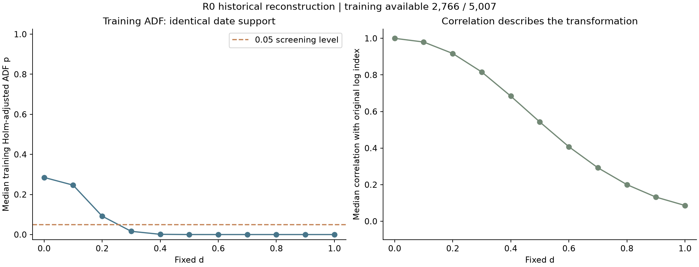
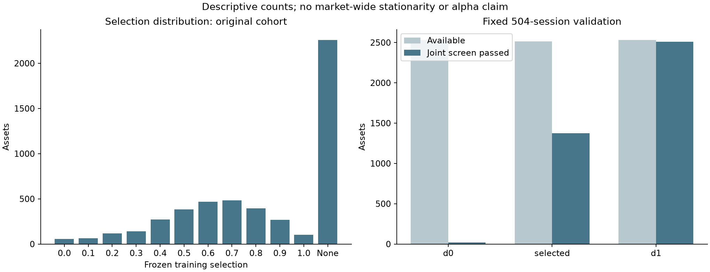
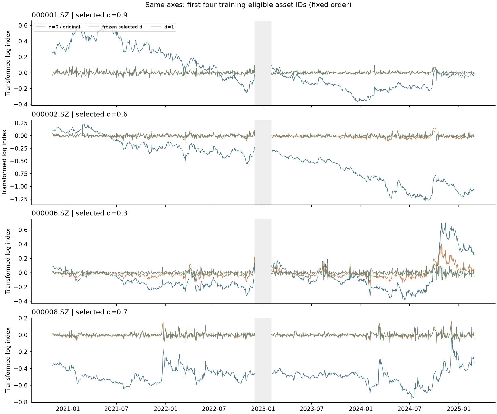

# 分数差分 R0 实验结果

本次按 v1 固定参数完成工程验收和历史诊断。数据更新到 2026-09-17；研究输入严格截止 2025-02-28。本目录发布结果报告、图表与汇总审计记录；原始数据、逐股过程文件和本次实验实现代码仍保留本地。报告以 Markdown 格式发布。

## 主要结果

原历史股票集合 **5,007** 只；训练共同支持合格 **2,766** 只（55.2%）。训练筛选选出 d 的股票 **2,748** 只，其中 0<d<1 为 **2,590** 只。选定 d 且完整验证可用 **2,515** 只，其中完整验证期同时满足 ADF p≤0.05、KPSS p≥0.05 为 **1,374** 只（可用者的 **54.6%**；原集合的 **27.4%**）。

这是固定有限滤波器和检验规则的描述性结果。训练选择不保证后段保持，统计通过不证明严格平稳，也不说明具有增量预测力或可交易收益。

## 输入、覆盖与时间边界

- 历史预热：2019-07-01 起；训练检验为训练区间最后 504 个 SSE 开市日，实际 2020-11-05 至 2022-11-30。
- 间隔：2022-12-01 至 2023-01-31，共 38 个交易日。
- 固定验证：2023-02-01 至 2025-02-28，共 504 日；前后各 252 日均完整报告，不择优。
- 全部 d 共用 252 点连续输入和相同训练日期，禁止缺失补零、压缩日期、重新锚定验证序列。
- 阶段数量：原集合 5007 → 训练可用 2766 → 选出 d 2748 → 选定 d 的完整验证可用 2515。
- 不论是否选出 d，训练合格股票中完整验证共同支持 2533；验证期新增股票 486 只仅记录覆盖。
- 原始 cohort 保留 ST、停牌与后段退市/缺失股票；训练末日板块分层固定，不使用今日存活名单。
- 每个已保存特征含 input_max_event_date、segment_anchor、observed_available_at、computed_at 与假设 replay_decision_at；历史可得性未认证。

训练排除原因按涉及股票数列示，原因可重叠：

| 原因 | 涉及股票数 |
|---|---:|
| not_historically_listed | 1395 |
| venue_change | 1265 |
| resumption | 928 |
| unverified_suspension | 100 |
| missing_or_nonfinite_return | 6 |

| 训练末板块 | 原集合 | 训练可用 | 完整验证共同支持 |
|---|---:|---:|---:|
| BSE | 130 | 0 | 0 |
| CHINEXT | 1223 | 600 | 558 |
| MAIN | 3166 | 2137 | 1946 |
| STAR | 488 | 29 | 29 |

## 冻结 d 的分布

| d | 股票数 |
|---|---:|
| 0.0 | 57 |
| 0.1 | 65 |
| 0.2 | 117 |
| 0.3 | 142 |
| 0.4 | 271 |
| 0.5 | 385 |
| 0.6 | 467 |
| 0.7 | 483 |
| 0.8 | 394 |
| 0.9 | 266 |
| 1.0 | 101 |

训练可用但无 d 满足：18 只；训练输入不可用：2241 只。二者在 selected_d 中均为空，但状态单独记录。

## 固定后段检验

验证 ADF 使用原始 p 值；训练选择中的 11 档 ADF 使用股内 Holm 校正。表中分母为该组实际可用者；所有原集合排除者仍保留在覆盖清单。子段不能当作独立复现。

| 区间 | 组 | 可用 | 联合检验通过 | 可用者通过比例 |
|---|---|---:|---:|---:|
| first_half | d0 | 2655 | 17 | 0.6% |
| first_half | d1 | 2655 | 2368 | 89.2% |
| first_half | selected | 2637 | 923 | 35.0% |
| full | d0 | 2533 | 21 | 0.8% |
| full | d1 | 2533 | 2511 | 99.1% |
| full | selected | 2515 | 1374 | 54.6% |
| second_half | d0 | 2533 | 31 | 1.2% |
| second_half | d1 | 2533 | 2518 | 99.4% |
| second_half | selected | 2515 | 1312 | 52.2% |

对照的同股票支持集比较（每段仅保留选定 d 可用的股票，三组完全同股同日）：

| 区间 | 组 | 共同股票数 | 联合检验通过 | 比例 |
|---|---|---:|---:|---:|
| full | d0 | 2515 | 21 | 0.8% |
| full | selected | 2515 | 1374 | 54.6% |
| full | d1 | 2515 | 2494 | 99.2% |
| first_half | d0 | 2637 | 17 | 0.6% |
| first_half | selected | 2637 | 923 | 35.0% |
| first_half | d1 | 2637 | 2350 | 89.1% |
| second_half | d0 | 2515 | 31 | 1.2% |
| second_half | selected | 2515 | 1312 | 52.2% |
| second_half | d1 | 2515 | 2500 | 99.4% |

## 合成验收

固定 seed=20260918，PCG64DXSM；四过程各 1,000 路径、每条 1,260 点。每条路径完整进行训练选择与冻结验证，没有事后调整参数或设定统计频率通过线。

| 过程 | 选出 d | 选定 d 后段通过/可用 | d=1 后段通过/1000 |
|---|---:|---:|---:|
| iid_gaussian | 1000 | 954/1000 | 1000/1000 |
| AR1_phi_0.8 | 1000 | 824/1000 | 1000/1000 |
| gaussian_random_walk | 958 | 521/958 | 944/1000 |
| integrated_AR1_phi_0.8 | 768 | 325/768 | 740/1000 |

已知非平稳的随机游走也可能在训练中选出分数 d，而后段检验保持率明显较低。252 系数截断通常保留非零权重和，不能据此声称严格消除了单位根。

## 来源与解释限制

逐日核对供应商 total_return 与 raw_close×adj_factor 的相邻比值；停牌零收益要求明确停牌来源及此前估值证据；复牌、转板、缺失均打断连续段。该审计验证供应商调整价格口径与项目收益构造的一致性。

记录调整因子变化事件 37,043 项；价格/收益来源审计错误事件汇总：{}。真实现金分红、送转事件账本没有另行独立认证，供应商事后修订风险仍然存在。本结论仅适用于这种重建调整收益口径，不能外推到真实时点或实际企业行动记账。

固定后段已被项目其他开发工作使用；不是全项目从未见过的新样本。未读取 2025-03-01 起 Holdout 值，未计算 IC/Sharpe、策略收益或 Alpha assertion，未更新研究 CURRENT。

## 工程与依赖记录

确定性检查包括独立二项式权重与直接卷积、d=0/1 对照、未来扰动、逐步追加、共同支持、停牌/复牌/缺失/转板、100% 损失、重复日期和合成企业行动。数值容差 atol=rtol=1e-12。

- statsmodels 0.14.5 与 pandas 3 的导入不兼容已修复为 pandas 2.3.3；原锁文件保留于 setup_attempts。
- 首次合成运行在结果写出时遇到 Polars 空值列推断错误；失败记录保留，修复后按完全相同输入、参数和 seed 重跑。
- requirements.lock 固定统计及绘图依赖精确版本与安装包哈希；uv.lock 固定基础环境。
- 最终检查修复未来源值错误影响过去支持集的边界问题；固定输入中不存在这类值，仍按同输入与 seed 重跑全部检验，旧结果独立留档。
- 没有因真实检验结果修改窗口、d 网格、阈值或 seed。

## 图表与逐股工件

原始逐股表、冻结支持集、选择文件、企业调整事件与特征来源记录仅保留本地；下列路径是本地工作树相对路径，不是本仓库已发布文件。

- 真实诊断：data/diagnostics/fracdiff_v1/real_4b18663145d322e4/_MANIFEST.json
- 真实 manifest SHA256：bfbf6233c9b8ad5cf0ba8d8d26aa9c4b3d90fc14d0932ad9e1c8239fbc1fe42a
- 合成诊断：data/diagnostics/fracdiff_v1/synthetic_a0425d75c72231f8/_MANIFEST.json
- 合成 manifest SHA256：e45c636b76f4b60730ad0a6f4958ce854b426f818416c9eeaf3be51c9fafff51
- 方案 SHA256：aeb1f381e9b196dce4508eed8d6a379a1c11e43d9a0b7dc388705c7dc922c6dd
- 数据门 SHA256：1a1d8aaa55cd8d9bd416e8d044160c51caa88904efcca1ebebb6da55c49a172e

统计实现参考：[statsmodels ADF](https://www.statsmodels.org/stable/generated/statsmodels.tsa.stattools.adfuller.html)、[statsmodels KPSS](https://www.statsmodels.org/stable/generated/statsmodels.tsa.stattools.kpss.html)。实际运行环境见 publication_manifest.json；依赖锁文件及完整运行 manifest 保留本地，其哈希用于来源核对。本结果包不包含独立重跑所需的全部实现与数据。

## 覆盖口径补充

覆盖原因解释

venue_change 为日状态板块字段发生变化的保守断点分类，包含未知/未上市状态到已知板块的转换，不能把该数字直接当作真实转板股票数。
not_historically_listed 包含为满足 252 点共同窗口而考察的训练前预热日期，因此上市不足的股票也计入该原因。
所有原因可重叠；未使用这些结果修改窗口或回补数据。
None 在分布图中合并训练不可用与无 d 通过，分开的状态在 selected_d_frozen.parquet 和报告中保留。
